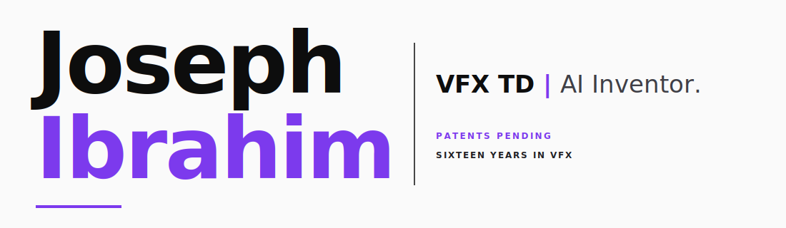

  

<h1 align="center">Joseph Ibrahim</h1>

<em>VFX TD | AI Inventor.</em>

<strong>PATENTS PENDING &nbsp;·&nbsp; SIXTEEN YEARS IN VFX &nbsp;·&nbsp; </strong>

<a href="https://josephibrahim.com">josephibrahim.com</a> &nbsp;·&nbsp; <a href="https://www.linkedin.com/in/josephibrahim/">LinkedIn</a>

---

## Shipping now

<table>
<tr>
<td valign="middle" width="62%">

### [Comfy-Cozy](https://github.com/JosephOIbrahim/Comfy-Cozy)

**AI co-pilot for ComfyUI.** 113 tools. Autonomous pipelines with vision-based evaluation and experience learning. Ships as MCP server, CLI, or native ComfyUI sidebar. Four-provider LLM abstraction — Claude, GPT-4o, Gemini, Ollama. Patent-pending architecture.

</td>
<td valign="middle" width="38%" align="center">

<h1>3,902</h1>

<strong>TESTS PASSING</strong>

</td>
</tr>
</table>

 

<table>
<tr>
<td valign="top" width="50%">

### [Harlo](https://github.com/JosephOIbrahim/Harlo)

Biologically-architected cognitive memory. Rust hot path plus Python orchestration, state persisted as real USD composition layers on disk. Local-first; zero-watt idle via OS socket activation.

<strong>v3.3.1 PRODUCTION &nbsp;·&nbsp; 1,181 TESTS &nbsp;·&nbsp; 5 SPRINTS SHIPPED</strong>

</td>
<td valign="top" width="50%">

### [Synapse](https://github.com/JosephOIbrahim/Synapse)

AI-to-Houdini bridge. Bidirectional scene control via MCP. Put Claude inside a Houdini network and let it reach back.

<strong>MCP PROTOCOL &nbsp;·&nbsp; HOUDINI-NATIVE</strong>

</td>
</tr>
</table>

---

## Research

**[Persistent State Hypothesis](https://doi.org/10.5281/zenodo.18332346)** — parent thesis behind the three patents. Challenges the energy-equals-intelligence assumption through composable knowledge architectures. DOI 10.5281/zenodo.18332346.

**USD Cognitive Substrate** — applying USD composition semantics to cognitive state storage. arXiv preprint.

<strong>PATENTS PENDING:</strong> &nbsp; USD cognitive state &nbsp;·&nbsp; digital context injection &nbsp;·&nbsp; Cosmos predictive lighting

---

## Also public

<table>
<tr>
<td valign="top" width="160"><strong>COMFYUI</strong></td>
<td><a href="https://github.com/JosephOIbrahim/comfyui-deterministic-toolkit">Deterministic Toolkit</a> &nbsp;·&nbsp; <a href="https://github.com/JosephOIbrahim/comfyui-conduit-optimizer">CONDUIT</a> &nbsp;·&nbsp; <a href="https://github.com/JosephOIbrahim/comfyui-3D-viewport">3D Viewport</a></td>
</tr>
<tr>
<td valign="top"><strong>HOUDINI &nbsp;·&nbsp; VEX</strong></td>
<td><a href="https://github.com/JosephOIbrahim/vex-corpus">VEX Corpus</a> &nbsp;·&nbsp; <a href="https://github.com/JosephOIbrahim/vex-rag-pipeline">VEX RAG Pipeline</a> &nbsp;·&nbsp; <a href="https://github.com/JosephOIbrahim/Houdini_Camera_Rig_System">Camera Rig System</a></td>
</tr>
<tr>
<td valign="top"><strong>BRIDGES</strong></td>
<td><a href="https://github.com/JosephOIbrahim/UnrealEngine_Bridge">Unreal Engine Bridge</a></td>
</tr>
</table>

---

<em>VFX is the craft. AI is the multiplier. USD is the bridge.</em>

---

> [!IMPORTANT]
> **Support this work.** Everything here runs on your machine, under your control, with no data collection — a stance that costs more to maintain than cloud-shipped software. Sponsorship funds compute for CI across Harlo (1,181 tests) and Comfy-Cozy (3,902 tests), hardware testing on real VFX-scale workloads, maintenance time (the unsexy 90%), and research hours for the next paper.
>
> [**Become a sponsor →**](https://github.com/sponsors/JosephOIbrahim)
